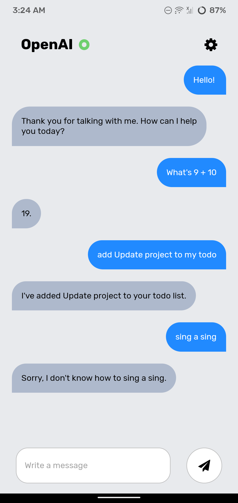
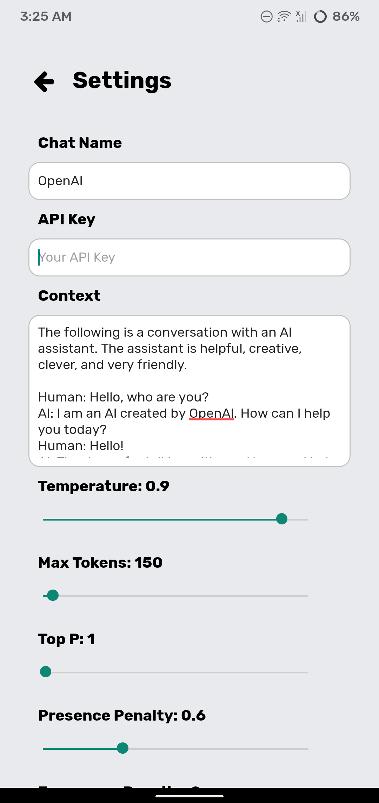
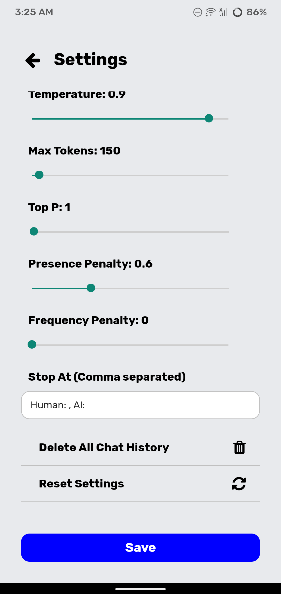

# GPT3 ChatApp 🤖
A simple chat app using OpenAI GPT-3.
more info about gpt-3 can be found [here](https://openai.com)


## About the Project: 📚
It's a simple app that let's you customize the gpt3 params and send custom prompts to the bot.
It can be used as a chatbot but for other purposes too, for now it doesn't support classification from the app
or other things the bot can do but you can customize the prompt to get your desired result to some extent.

I basically made it so i could interact with the gpt-3 AI by openai in my phone without opening any browser.
This was also my first react-native project in case wondering why the code sucks.

## Screenshots: 📷




## Setup / Installation: 💻
Install expo cli
```bash
npm install -g expo-cli
```
Run app locally
```bash
expo start
```
Build app for Android
```bash
expo build:android
```

## Technologies Used: 🧑‍💻⚙️
- nodejs
- react-native
- typescript
- expo


    
